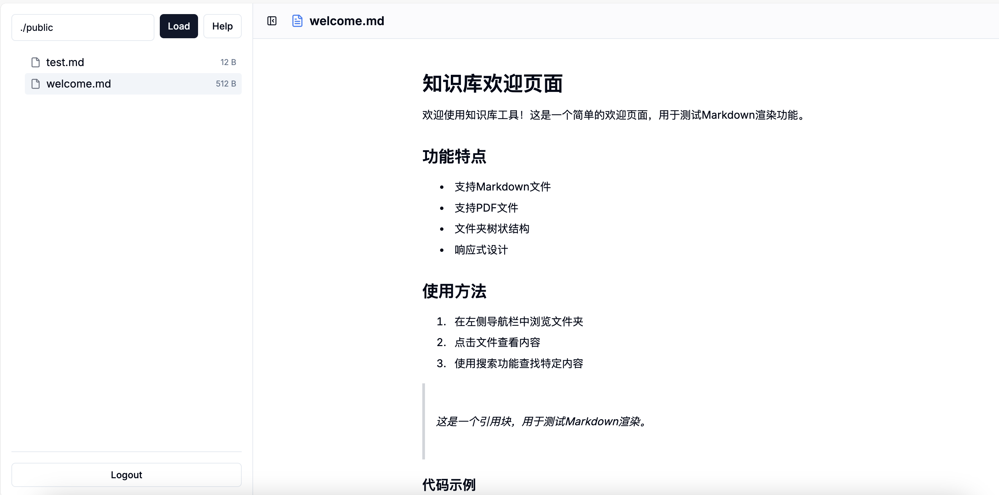
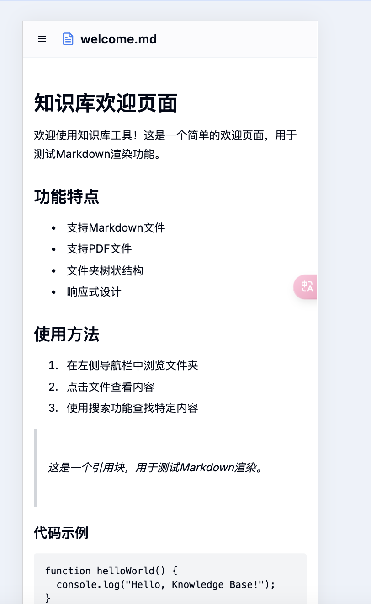

# Obsidian-Reader 跨端阅读器
## 介绍
最近一直在用Obsidian-browser去做笔记，然后用webdav去做备份，由于我主力是mac，手机是安卓，我又想通过手机看笔记记录，还不想手机做同步占用存储。于是就诞生了该项目。

## 最佳实践
1. 本地使用Obsidian做笔记
2. 有个nas通过webdav进行笔记同步，此处我用的是 威联通 做的webdav，通过 Remotely Sync 插件进行同步 (可参考：https://zhuanlan.zhihu.com/p/670278442)
3. 通过该项目配置.env的KB_DATA_PATH 路径为你的nas的绝对路径，就可以挂载
4. 并且你需要设置KB_PASSWORD来作为访问密码，防止你的笔记被别人访问。
5. 通过docker-compose up -d 启动服务即可。

## 功能支持
1. 目前适配了Obsidian格式的markdown语法，图片之类的均可渲染
2. 目前pdf也做了支持
3. 暂时没有看xslx和docx和其他的需求，需要的话可以提issue，我来加。

## 截图

